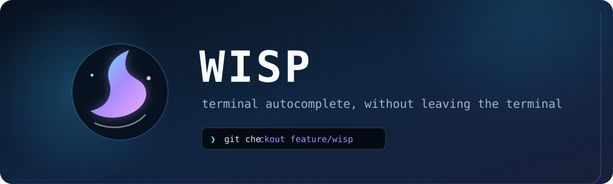
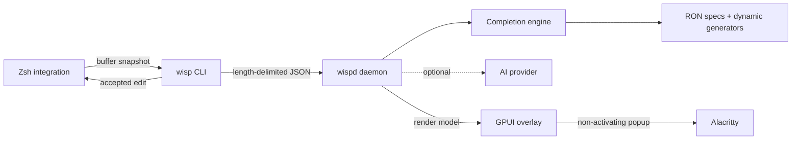

<div align="center">
  

  <br />

  <p>
    <strong>Fast, context-aware terminal completion with a native floating UI.</strong><br />
    Built in Rust for macOS, Alacritty, and Zsh.
  </p>

  <p>
    
    
    
    
    
  </p>
</div>

> [!IMPORTANT]
> Wisp is currently an MVP. The supported experience is **macOS + Alacritty + Zsh**; other platforms still need adapters.

## Why Wisp?

Wisp brings IDE-like suggestions to the command line without taking focus away from your terminal. It combines deterministic, low-latency completions with optional AI ghost text, then renders everything in a native GPUI popup positioned beside the real Alacritty cursor.

| | Capability | What it gives you |
| :--: | --- | --- |
| ⚡ | Native completion | Commands, options, files, directories, Git branches, and Docker containers |
| ✨ | Optional AI | OpenAI-compatible or custom-process providers for inline ghost text |
| 🎯 | Precise placement | Cursor-aware popup positioning, including wrapped prompts and Unicode input |
| 🧠 | Shell-aware parsing | Tolerates incomplete quotes, pipelines, and partially typed commands |
| 🔒 | Local-first safety | Unix socket permissions, cancellation, stale-result rejection, and secret detection |
| 🪶 | Non-activating UI | Never steals focus; leaving Alacritty dismisses the current popup |

## Quick start

### Requirements

- macOS
- [Alacritty](https://alacritty.org/) and Zsh
- Rust **1.98+**
- Accessibility permission for terminal window discovery

### Build and launch

From the repository root:

```bash
cargo build --release --workspace

./target/release/wisp start
eval "$(./target/release/wisp init zsh)"
```

The `wisp`, `wispd`, and `wisp-overlay` binaries must remain next to one another. To enable Wisp in future shells, put `target/release` on your `PATH` and add this to `~/.zshrc`:

```zsh
eval "$(wisp init zsh)"
```

Run `wisp start` after login to launch the daemon and overlay. On first use, macOS may ask for **Accessibility** permission because Wisp uses System Events to read the active Alacritty window frame.

## Key bindings

Wisp preserves normal Zsh behavior whenever it has nothing to act on.

| Key | Wisp action | Fallback |
| --- | --- | --- |
| `Tab` | Accept selected candidate | Zsh completion |
| `Right` | Accept AI ghost text | Move cursor right |
| `Up` / `Ctrl-P` | Select previous candidate | Previous history entry |
| `Down` / `Ctrl-N` | Select next candidate | Next history entry |
| `Esc` / `Ctrl-G` | Dismiss suggestions | Normal keymap behavior |

Directory candidates continue completion automatically, so accepting `src/` immediately opens suggestions inside it.

## AI ghost text

AI is optional and disabled when no default provider is configured. Wisp supports OpenAI-compatible Chat Completions endpoints, local model servers, and custom executables.

Copy the example configuration to the platform config directory:

```bash
# macOS
mkdir -p "$HOME/Library/Application Support/dev.wisp.wisp"
cp config.example.toml "$HOME/Library/Application Support/dev.wisp.wisp/config.toml"

# Linux config location (the full overlay is not yet supported there)
mkdir -p "$HOME/.config/wisp"
cp config.example.toml "$HOME/.config/wisp/config.toml"
```

The included example targets a local OpenAI-compatible server:

```toml
default_provider = "local"

[completion]
# 0 means unlimited.
max_candidates = 0

[providers.local]
type = "openai-compatible"
base_url = "http://127.0.0.1:11434/v1"
model = "qwen2.5-coder"
timeout_ms = 800
```

For remote providers, keep the API key out of the file and reference an environment variable with `api_key_env = "WISP_AI_API_KEY"`.

Wisp only requests AI output when the cursor is at the end of a line, after 120 ms of idle time. Buffers that look like they contain passwords, tokens, secrets, or private keys are not sent. Responses are capped and stripped of newlines, NUL bytes, and terminal escape sequences before reaching Zsh.

<details>
<summary><strong>Custom process provider contract</strong></summary>

```toml
[providers.custom]
type = "process"
command = ["/usr/local/bin/my-wisp-provider"]
timeout_ms = 800
```

The program receives one JSON request on standard input and writes one JSON object to standard output:

```json
{
  "suffix": " --release",
  "confidence": 0.92,
  "model": "my-model"
}
```

Leading spaces in `suffix` are significant.

</details>

## How it works



| Crate | Responsibility |
| --- | --- |
| `wisp-cli` | User commands, shell integration, diagnostics, and IPC client |
| `wisp-daemon` | Session state, completion orchestration, cancellation, and overlay updates |
| `wisp-core` | Parser, fuzzy ranking, completion engine, and RON specs |
| `wisp-ai` | OpenAI-compatible and external-process providers |
| `wisp-overlay` | Native GPUI candidate popup and ghost-text rendering |
| `wisp-platform` | Alacritty cursor-to-screen coordinate mapping |
| `wisp-protocol` | Shared messages and length-delimited JSON transport |

## Completion specs

Static command metadata lives in [`specs/`](specs) as data-only RON, one file per command: the complete `@withfig/autocomplete` 2.692.3 snapshot, 1,484 modules, including recursive subcommands, aliases, options, arguments, static suggestions, path templates, versioned specs, and `loadSpec` references. A spec's id is its path below `specs/`, so `az/2.53.0/network.ron` is the spec `az/2.53.0/network`. `crates/wisp-core/build.rs` compresses every one of those files into a single container that the binary embeds, and the daemon inflates a document only when a command is first completed, so it never deserializes the roughly 240 MB data set at startup.

Imported Fig callbacks and shell generators remain inert metadata unless Wisp has a reviewed Rust adapter. Built-in dynamic generators—such as Git branches and running Docker containers—are registered in Rust, so a completion spec cannot execute arbitrary shell commands. The original Fig MIT notice and import coverage report live in [`specs/`](specs).

## Positioning and calibration

Wisp asks Alacritty for a standard `CSI 6n` cursor-position report and uses both its real row and column as the base terminal cell. Since ZLE reports the frame before repainting, Wisp applies only the linear cell delta between the previously rendered buffer and the current buffer. When running inside zellij, Wisp also reads the active pane's content origin and the outer terminal grid, so wrapped commands in split panes map to the correct Alacritty cell instead of stretching pane-local coordinates across the whole window. The popup keeps an 8 px cursor gap and flips above the cursor when there is not enough room below. Leaving Alacritty dismisses the current render request; returning does not restore it until the buffer changes.

For custom window decorations or padding:

```bash
export WISP_ALACRITTY_TITLEBAR=28
export WISP_ALACRITTY_PADDING_X=0
export WISP_ALACRITTY_PADDING_Y=0
```

For deterministic tests, bypass System Events with `x,y,width,height` screen coordinates:

```bash
export WISP_ALACRITTY_BOUNDS="100,200,800,600"
```

## Diagnostics

Run these commands **inside Alacritty**:

```bash
wisp doctor
wisp ping
wisp demo "git che"
```

- `doctor` checks the daemon, terminal detection, active window lookup, and cursor placement.
- `ping` verifies the Unix socket connection.
- `demo` sends a completion snapshot and prints the returned render model.

## Development

Run each component independently:

```bash
# Terminal 1
RUST_LOG=wisp=debug cargo run -p wisp-daemon --bin wispd

# Terminal 2
cargo run -p wisp-overlay --bin wisp-overlay

# Current Zsh session
eval "$(cargo run -q -p wisp-cli --bin wisp -- init zsh)"
```

Before submitting changes:

```bash
cargo fmt --all -- --check
cargo test --workspace
cargo clippy --workspace --all-targets -- -D warnings
```

## Roadmap

- Additional terminal and operating-system adapters
- More shell integrations
- Broader completion-spec coverage
- Packaging and a first-class installer

## License

Licensed under either **MIT** or [**Apache-2.0**](LICENSE-APACHE), at your option.

<div align="center">
  <sub>Built for people who want the speed of a shell and the guidance of an IDE.</sub>
</div>
